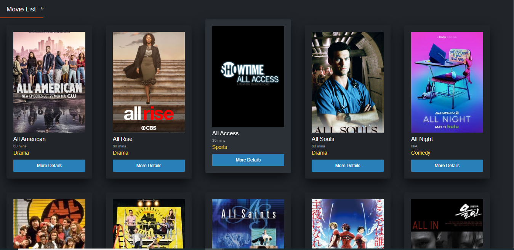
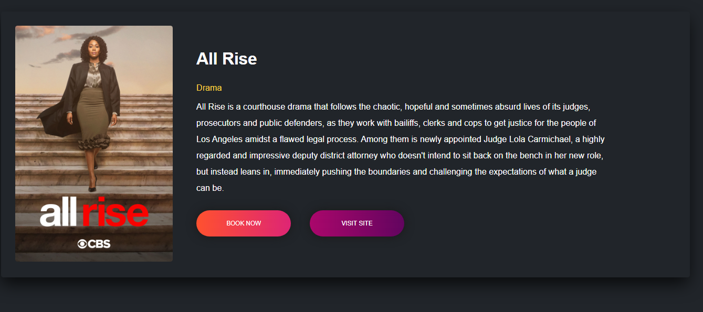

<h1 align="center">Welcome to movie_app 👋</h1>
<p>
  <a href="https://www.npmjs.com/package/movie_app" target="_blank">
    
  </a>
  <a href="#" target="_blank">
    
  </a>
</p>

> Movie app is a simple movie database which give information about the movies and web seires



Demo link - https://npmovieinfo.netlify.app/

## Install

```sh
npm install
```

## Usage

```sh
npm start
```

## Run tests

```sh
npm run test
```

## Author

👤 **Shreekant**

- Github: [@sreekant-np](https://github.com/sreekant-np)
- LinkedIn: [@sreekant-np](https://linkedin.com/in/sreekant-np)

